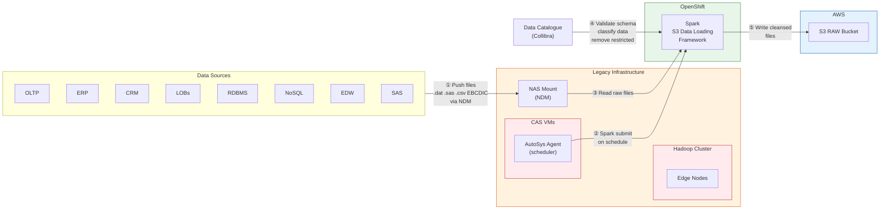
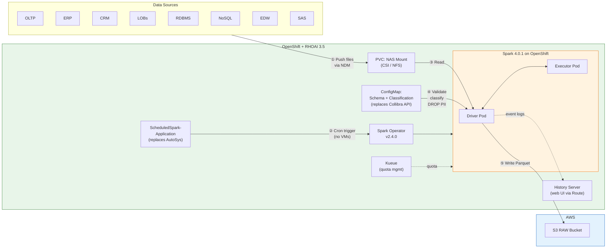
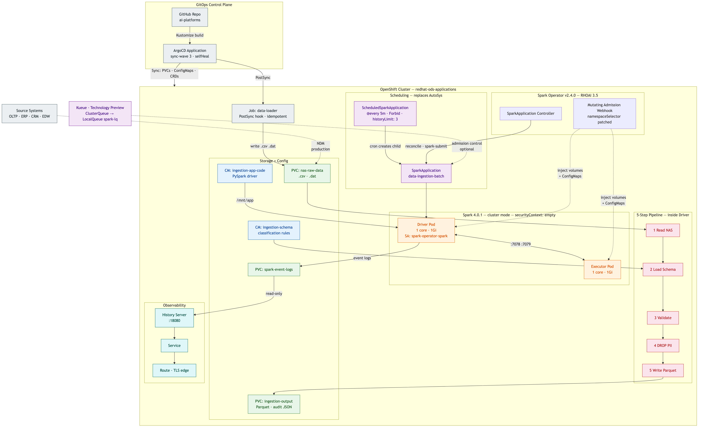

# Data Ingestion Batch Pattern — Spark on RHOAI 3.5

## What This Demo Is

A working proof-of-concept that shows how an enterprise **batch data ingestion
pipeline** — the kind that today runs on legacy Hadoop clusters with AutoSys
schedulers and manual Spark submits — can run natively on **Red Hat OpenShift AI**
using the Kubeflow Spark Operator, with no Hadoop, no VMs, and no legacy schedulers.

## The Business Problem

Large enterprises ingest data from dozens of source systems (OLTP, ERP, CRM,
mainframes, SAS, EDW) into a central data lake. A typical flow looks like this:

1. Source systems push raw files (`.dat`, `.csv`, `.sas`, EBCDIC) onto a **NAS mount**
   via NDM (Network Data Mover) services
2. A **legacy scheduler** (AutoSys, Control-M) fires a Spark submit on a schedule
3. Spark reads the raw files from the NAS mount
4. Spark consults a **data catalogue** (Collibra) to validate the file schema and
   apply data classification rules — identifying and **removing restricted/PII data**
   (Social Security numbers, full names, dates of birth, physical addresses)
5. Spark writes the cleansed data as Parquet into an **S3 bucket** (via AWS Direct Connect)

Today this runs on aging Hadoop clusters with edge nodes, manual Spark installs,
and AutoSys agents on VMs. The infrastructure is expensive, hard to scale,
and difficult to govern.

### Legacy Architecture (Before)



### RHOAI Architecture (After)



**What changed:** The Hadoop cluster, edge nodes, and AutoSys VMs are eliminated entirely.
The same 5-step flow runs on OpenShift as Kubernetes-native CRDs — declarative,
GitOps-managed, and observable through the Spark History Server.

## What This Demo Replaces

| Legacy Component | RHOAI Replacement | Benefit |
|---|---|---|
| Hadoop cluster + edge nodes | OpenShift + Spark Operator | No dedicated Hadoop infrastructure; Spark runs as pods |
| AutoSys / Control-M scheduler on VMs | `ScheduledSparkApplication` CRD | Kubernetes-native cron; no scheduler VMs or agents |
| Manual `spark-submit` scripts | `SparkApplication` CRD (declarative YAML) | GitOps-managed, version-controlled, self-healing via ArgoCD |
| Collibra API calls in application code | ConfigMap with schema + classification rules | Same pattern, pluggable; swap ConfigMap for API call in production |
| NAS mount (physical) | PersistentVolumeClaim (simulated) | In production, mount the real NAS via CSI driver or NFS |
| AWS S3 via Direct Connect | PersistentVolumeClaim (simulated) | In production, write to `s3a://` with hadoop-aws JARs |
| No resource governance | Kueue quota management | Fair-share scheduling, multi-tenant resource limits |
| Log into nodes to check job status | Spark History Server (web UI) | OpenShift Route with TLS; accessible from any browser |

## Architecture



## The 5-Step Flow

Matches the reference architecture diagram step-by-step:

```
  Source Systems                          OpenShift / RHOAI
  +-----------+                    +------------------------------+
  | OLTP, ERP |   1. Raw files     |                              |
  | CRM, LOBs |  ------------>    |   NAS PVC                    |
  | RDBMS     |   (.dat, .csv)    |   (nas-raw-data)             |
  | NoSQL,EDW |                    |        |                      |
  +-----------+                    |   2. ScheduledSpark-          |
                                   |      Application triggers     |
  +----------+                     |      spark-submit (cron)      |
  | Collibra |   4. Schema +       |        |                      |
  | Data     | <---- classify -----|   3. Spark reads raw files    |
  | Catalogue|                     |        |                      |
  +----------+                     |   4. Validate schema,         |
                                   |      classify columns,        |
                                   |      DROP restricted (PII)    |
                                   |        |                      |
                                   |   5. Write cleansed Parquet   |
                                   |      to output PVC            |
                                   |      (simulates S3 bucket)    |
                                   +------------------------------+
```

**Step 1 — Source systems land raw files on NAS:**
In production, NDM services push files. In the demo, a Kubernetes Job generates
synthetic banking data: 200 transactions (CSV), 100 customers with PII (pipe-delimited
DAT), and 80 account records (CSV with intentional schema violations).

**Step 2 — Scheduler triggers Spark:**
In production, AutoSys agents on VMs run spark-submit. In the demo, a
`ScheduledSparkApplication` CRD runs on a cron schedule (`@every 5m`). The Spark
Operator handles the spark-submit internally.

**Step 3 — Spark reads raw files from NAS:**
The PySpark driver reads from the NAS PVC (`/mnt/nas-input`). It supports CSV
(comma-delimited) and DAT (pipe-delimited) formats, matching real-world batch file
landing patterns.

**Step 4 — Schema validation and data classification:**
The driver loads schema metadata from a ConfigMap (simulating a Collibra API response).
For each dataset, it:
- Validates all required columns are present
- Detects null values in required fields (flags schema violations)
- Classifies each column as `public`, `internal`, `confidential`, or `restricted`
- **Drops all `restricted` columns** — removing PII (full_name, ssn, date_of_birth, address)

**Step 5 — Write cleansed data to output:**
Cleansed DataFrames are written as Parquet (columnar, compressed) to the output PVC.
An audit report (JSON) is generated summarizing every dataset: records in/out,
columns dropped, schema violations found. In production, the output path would be
`s3a://raw-bucket/` via AWS Direct Connect.

## What You See When It Runs

```
DATA INGESTION BATCH JOB
NAS -> Schema Validate -> Classify/PII Removal -> Output

Processing: transactions
  Found 1 file(s): ['transactions_batch_001.csv']
  Raw records: 200
  Schema valid: True
  No restricted columns to drop
  Written 200 records to: /mnt/output/transactions

Processing: customers
  Found 1 file(s): ['customers_batch_001.dat']
  Raw records: 100
  Schema valid: True
  CLASSIFIED — Dropped restricted columns: ['full_name', 'ssn', 'date_of_birth', 'address']
  Written 100 records to: /mnt/output/customers

Processing: accounts
  Found 1 file(s): ['accounts_batch_001.csv']
  Raw records: 80
  Schema valid: True
  WARNING — Null values in required fields: {'status': 4, 'branch_code': 4, 'balance': 4, 'opened_date': 4}
  Written 80 records to: /mnt/output/accounts

INGESTION SUMMARY
  transactions: 200 -> 200 records (dropped columns: none)
  customers: 100 -> 100 records (dropped columns: ['full_name', 'ssn', 'date_of_birth', 'address'])
  accounts: 80 -> 80 records (dropped columns: none)
```

Key takeaway: the `customers` dataset had 12 columns including PII. After classification,
4 restricted columns were removed. The output Parquet has only 8 columns — no SSN, no
names, no addresses. This is the data governance enforcement step.

## Three Ways to Run

| Mode | Resource | Use Case |
|---|---|---|
| **Single run** | `SparkApplication` | Ad-hoc ingestion, testing, backfill |
| **Scheduled** | `ScheduledSparkApplication` | Production cron (replaces AutoSys) |
| **Kueue-managed** | `SparkApplication` + queue label | Multi-tenant with quota enforcement |

All three modes were verified on the demo cluster and produced identical results.

---

## Prerequisites

- OpenShift 4.19+ with RHOAI 3.5 installed
- Spark Operator enabled (`sparkoperator: Managed` in DataScienceCluster)
- Webhook namespace selector patched to include target namespace (see below)
- NetworkPolicy for Spark pod communication (RHOAIENG-53206)
- (For Kueue mode) Red Hat build of Kueue Operator with SparkApplication integration

## Pre-Deployment Fixes

Two fixes are required before this demo works in `redhat-ods-applications`:

### 1. Webhook Namespace Selector

The Spark Operator webhook only intercepts pods in the `default` namespace by default.
This is set in the upstream kustomize config (`config/webhook/webhook-objectselector-patch.yaml`).
Without this fix, volumes and ConfigMaps are **not mounted** into Spark driver/executor pods.

```bash
oc patch mutatingwebhookconfiguration mutating-webhook-configuration --type='json' \
  -p='[
    {"op":"replace","path":"/webhooks/0/namespaceSelector/matchExpressions/0/values",
     "value":["default","redhat-ods-applications"]},
    {"op":"replace","path":"/webhooks/1/namespaceSelector/matchExpressions/0/values",
     "value":["default","redhat-ods-applications"]},
    {"op":"replace","path":"/webhooks/2/namespaceSelector/matchExpressions/0/values",
     "value":["default","redhat-ods-applications"]},
    {"op":"replace","path":"/webhooks/3/namespaceSelector/matchExpressions/0/values",
     "value":["default","redhat-ods-applications"]}
  ]'

oc patch validatingwebhookconfiguration validating-webhook-configuration --type='json' \
  -p='[
    {"op":"replace","path":"/webhooks/0/namespaceSelector/matchExpressions/0/values",
     "value":["default","redhat-ods-applications"]},
    {"op":"replace","path":"/webhooks/1/namespaceSelector/matchExpressions/0/values",
     "value":["default","redhat-ods-applications"]},
    {"op":"replace","path":"/webhooks/2/namespaceSelector/matchExpressions/0/values",
     "value":["default","redhat-ods-applications"]}
  ]'
```

### 2. NetworkPolicy (RHOAIENG-53206)

The `redhat-ods-applications` namespace has a default deny-all rule. Spark executor
pods cannot reach the driver without this NetworkPolicy:

```bash
oc apply -n redhat-ods-applications -f - <<'EOF'
apiVersion: networking.k8s.io/v1
kind: NetworkPolicy
metadata:
  name: spark-operator-allow-internal
spec:
  podSelector:
    matchLabels:
      sparkoperator.k8s.io/launched-by-spark-operator: "true"
  policyTypes: [Ingress]
  ingress:
    - ports:
        - { port: 7078, protocol: TCP }
        - { port: 7079, protocol: TCP }
        - { port: 4040, protocol: TCP }
      from:
        - podSelector: {}
        - namespaceSelector:
            matchLabels:
              network.openshift.io/policy-group: ingress
EOF
```

## GitOps Deployment (ArgoCD)

This workload is fully declarative — no manual `oc cp`, no image builds, no scripts.

1. ArgoCD syncs the kustomization to the cluster (sync-wave 3)
2. PVCs are created for NAS input, cleansed output, and Spark event logs
3. ConfigMaps are created for schema metadata, application code, and data generator
4. A data-loader Job (ArgoCD sync hook) generates synthetic data inside the NAS PVC
5. ScheduledSparkApplication deploys and runs ingestion on its cron schedule
6. Spark History Server deploys with an OpenShift Route for the web UI

## Technical Reference

| Property | Value |
|---|---|
| Spark version | 4.0.1 |
| Spark image | `quay.io/opendatahub/data-processing:Spark-v4.0.1` |
| Spark Operator version | v2.4.0 |
| Spark mode | `cluster` (only mode supported by operator) |
| Python version | 3 (PySpark) |
| SecurityContext | `{}` — OpenShift restricted-v2 SCC assigns arbitrary UID |
| ServiceAccount | `spark-operator-spark` (created by RHOAI operator) |
| CRD API version | `sparkoperator.k8s.io/v1beta2` |
| Volume injection | Mutating Admission Webhook on pod creation |

### Kueue Integration (Technology Preview in RHOAI 3.5)

Requires: Kueue Operator installed, `SparkApplication` in Kueue CR frameworks,
ClusterQueue + LocalQueue configured. Kueue suspends the SparkApplication until
quota is available, then unsuspends. Dynamic allocation is not supported with Kueue.

### Data Classification Policy

| Classification | Action | Columns |
|---|---|---|
| `public` | KEEP | transaction_date, currency, city, state |
| `internal` | KEEP | account_id, customer_id, risk_rating |
| `confidential` | KEEP | amount, email, phone |
| `restricted` | **DROP** | full_name, ssn, date_of_birth, address |

### File Inventory

```
spark-data-ingestion/
+-- kustomization.yaml               # Kustomize entry point
+-- README.md                        # This file
+-- input-pvc.yaml                   # NAS simulator (1Gi)
+-- output-pvc.yaml                  # Output storage (1Gi)
+-- event-logs-pvc.yaml              # Spark event logs for History Server
+-- schema-configmap.yaml            # Schema + classification rules
+-- app-configmap.yaml               # PySpark ingestion application
+-- sample-data-configmap.yaml       # Data generator (for demo only)
+-- data-loader-job.yaml             # Populates NAS PVC (ArgoCD hook)
+-- spark-data-ingestion.yaml        # SparkApplication (single run)
+-- spark-data-ingestion-kueue.yaml  # SparkApplication with Kueue
+-- scheduled-data-ingestion.yaml    # ScheduledSparkApplication (cron)
+-- spark-history-server.yaml        # History Server + Service + Route
```

### From Demo to Production

| Demo | Production Change |
|---|---|
| PVC `nas-raw-data` with synthetic data | Mount real NAS via CSI driver or NFS PV |
| ConfigMap `ingestion-schema` | REST call to Collibra API at job start |
| PVC `ingestion-output` with Parquet | `s3a://bucket/raw/` with hadoop-aws JARs + S3 Secret |
| `@every 5m` schedule | Match actual batch landing cadence (e.g. `0 2 * * *`) |
| 1 executor, 1Gi memory | Scale to match data volume (e.g. 10 executors, 8Gi each) |
| No alerting | Prometheus metrics + AlertManager rules on job failure |

### Verified On

- OpenShift 4.19 with RHOAI 3.5.1
- Spark Operator v2.4.0 / Spark 4.0.1
- Red Hat build of Kueue Operator (SparkApplication integration)
- gp3-csi StorageClass (AWS EBS)
- All three run modes (single, scheduled, Kueue) completed successfully
